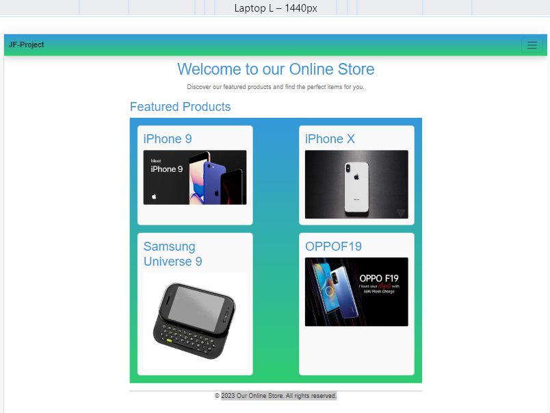
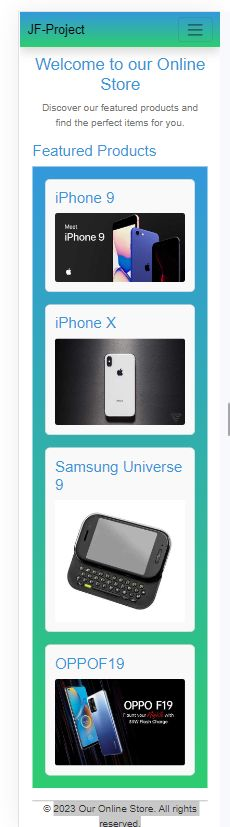

# React + Vite project sample
## Products

Egy bolt félig kész weboldalát kellene befejezni, az alábbi követelmények szerint:
- A félig kész weboldal egy  React – Vite projekt, **pnpm** csomagkezelővel létrehozva
- A projekt megtalálható az alábbi GitHub linken:
  [Projekt URL](...)
- A projekt tartalmaz pár automata tesztesetet is, melyek a Vitest keretrendszerrel vannak megvalósítva. A test mappa alatt találhatóak és ezeket nem kell/nem szabad módosítani.
A sikeres megoldás esetén minden teszt helyesen le fog futni.A tesztesetek futtatása:
    > pnpm run test
- a munkát egy GitHub repoba kell feltölteni és a repo URL-jét leadni
- a repo neve **JF_vizsga** legyen
- a repo tartalmazzon egy Readme.md fájlt amelyben szerepelnek az alábbi adatok:        
  - a publikált produktum URL-jét
  - a vizsgázó nevét
- A **package.json** fájl tartalmazza a feladatok megoldásához szükséges függőségeket, új csomag telepítése nem szükséges (de megengedett).
- A tesztesetek sikeres futtatása szükséges, de nem elégséges feltétele a feladatok megoldásának, az alkalmazásnak a szöveges leírásnak is meg kell felelnie.
- Az elkészített programkódnak a funkcionalitás mellett a tiszta kód elveinek is meg kell felelnie – nehezen áttekinthető kódért pontlevonás, teljesen olvashatatlan kódért pedig akár 0 pont is járhat.
  
### 1.feladat- Az alkalmazás főoldalának a kialakítása

- Készítsen egy új komponenst a főoldal számára, a neve legyen: **Home**. 
- Állítsa be, hogy a „/” route ezt a komponenst használja.
- a főoldal szerkezete/szövege a minta szerint legyen kialakítva, betartva az alábbiakat:

    - tartalmazzon 3 szemantikus elemet: **header, main** és **footer**
    - a header-ben legyen egy **egyes szintű címsor** és egy **bekezdés** a mintán látható szöveggel
    - a main tartalmazzon egy **kettes szintű címsor** a minta szerint és egy **FeaturedProducts** nevű komponenst, amely megjeleníti a kiemelt termékeket
    - a kiemelt termékek adatait a projekt mappa alatt található **data.js** fájlban találjuk meg
    - a footer elemben levő bekezdés tartalma a minta szerinti szöveget tartalmazza
    - a főoldal formázásához hozzon létre egy scss fájlt és abban formázzon, vagy használhatja bootstrap keretrendszert is az oldal kialakításához
    - a színátmenetes háttér kialakításához használja a **variables.scss** fájlban deklarált változókat
  
  